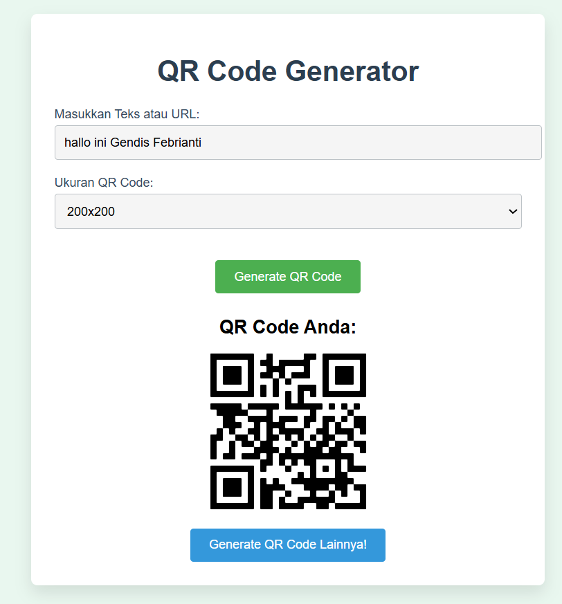

# QR Code Generator di Laravel

Proyek ini adalah implementasi **QR Code Generator sebagai tanda tangan digital** menggunakan Laravel.  
Fitur ini memungkinkan pengguna untuk membuat QR Code dari sebuah URL atau teks.

## 📌 Fitur
✅ Generate QR Code dari URL atau teks
✅ Simpan QR Code ke dalam storage Laravel  
✅ Tampilkan QR Code di halaman web  

## langkah-langkah instalasi & menjalankan project
1. instalasi laravel dan create project
2. kemudian install library QR code dengan perintah **composer require simplesoftwareio/simple-qrcode**
3. membuat folder **qrcode** dan buat halaman index **resource/views/qrcode/index.blade.php**
   yang berisi form untuk input URL/teks yang akan di Generate menjadi QR code yang akan tampil pada view
4. membuat controller **http/controllers/QRcodeController.php** dengan :
   **php artisan make:controller QRCodeController**
5. membuat route pada **routes/web.php**
6. jalankan aplikasi **php artisan serve**
7. akses aplikasi di browser **http://127.0.0.1:8000**

## hasil
1. Isi URL/teks di kolom input.
2. Pilih ukuran QR Code.
3. Klik tombol "Generate QR Code" untuk melihat hasil QR Code.

